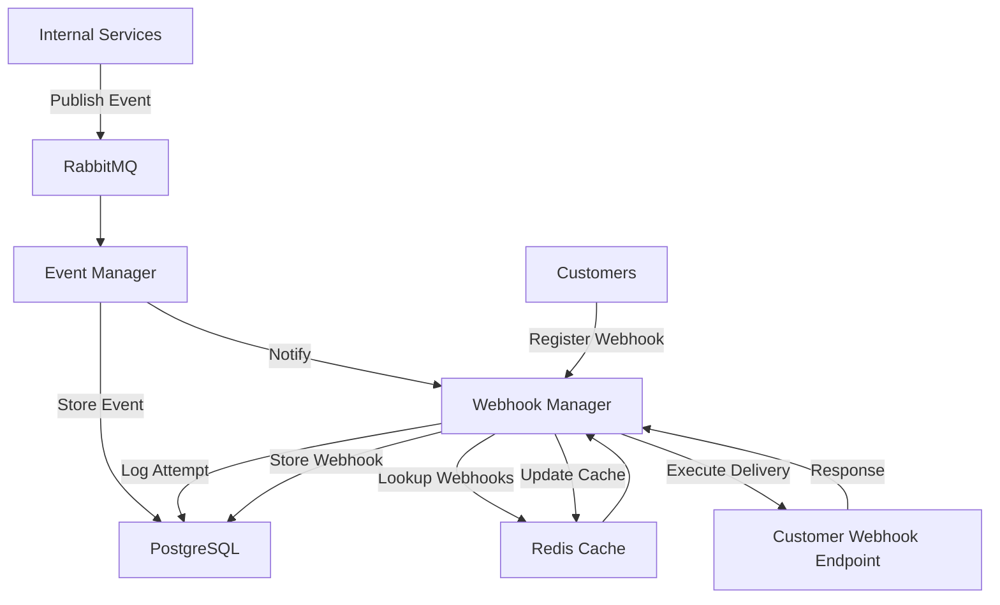

# Webhook Manager Service

A Node.js microservice for reliable webhook delivery with real-time visualization.

## Overview

This service handles webhook registration, caching, delivery execution with retry logic, and status tracking. It integrates with RabbitMQ for event notifications and provides a REST API for management operations.

## Features

- **Webhook Registration**: Register webhooks for specific event types
- **Redis Caching**: Fast lookup of webhooks by event type
- **Reliable Delivery**: Exponential backoff retry strategy
- **Status Tracking**: Comprehensive delivery attempt logging
- **Real-time Visualization**: p5.js dashboard for monitoring
- **REST API**: Full CRUD operations for webhook management

## Architecture

```
┌─────────────────┐    ┌──────────────┐    ┌─────────────────┐
│   Event Manager │───▶│   RabbitMQ   │───▶│ Webhook Manager │
│                 │    │              │    │                 │
└─────────────────┘    └──────────────┘    └─────────────────┘
                                                        │
                                                        ▼
┌─────────────────┐    ┌──────────────┐    ┌─────────────────┐
│   PostgreSQL    │◀───│   Status     │    │     Redis      │
│   Database      │    │   Tracker    │    │     Cache      │
└─────────────────┘    └──────────────┘    └─────────────────┘
                                                        │
                                                        ▼
┌─────────────────┐    ┌──────────────┐    ┌─────────────────┐
│   Customer      │◀───│ Delivery     │    │   p5.js        │
│   Webhooks      │    │ Executor     │    │ Visualization  │
└─────────────────┘    └─────────────────┘    └─────────────────┘
```

## Architecture Diagram

The diagram below shows how internal event producers, RabbitMQ, the Webhook Manager, Redis cache, PostgreSQL, and customer endpoints interact.



See `architecture-diagram.md` for the standalone diagram file.

## Prerequisites

- Node.js 16+
- PostgreSQL 12+
- Redis 6+
- RabbitMQ 3.8+

## Installation

1. Clone the repository
2. Install dependencies:
   ```bash
   npm install
   ```
3. Set up environment variables:
   ```bash
   cp .env.example .env
   # Edit .env with your configuration
   ```
4. Set up database:
   ```bash
   psql -d webhook_db -f schema.sql
   ```

## Usage

Start the service:
```bash
npm start
```

The service will start:
- API server on port 3000
- p5.js visualization in browser
- RabbitMQ event listener

## API Endpoints

### Webhook Management
- `POST /webhooks` - Register a webhook
- `GET /webhooks/:id` - Get webhook details
- `PUT /webhooks/:id` - Update webhook
- `DELETE /webhooks/:id` - Deactivate webhook
- `GET /customers/:customerId/webhooks` - Get customer webhooks

### Delivery Status
- `GET /deliveries?event_id={id}` - Get delivery status for event
- `GET /stats/deliveries` - Get delivery statistics
- `GET /retries/pending` - Get pending retries

### Health Check
- `GET /health` - Service health status

## Configuration

Environment variables:

| Variable | Default | Description |
|----------|---------|-------------|
| `DB_HOST` | localhost | PostgreSQL host |
| `DB_PORT` | 5432 | PostgreSQL port |
| `DB_NAME` | webhook_db | Database name |
| `DB_USER` | postgres | Database user |
| `DB_PASSWORD` | password | Database password |
| `REDIS_HOST` | localhost | Redis host |
| `REDIS_PORT` | 6379 | Redis port |
| `RABBITMQ_URL` | amqp://localhost | RabbitMQ connection URL |
| `PORT` | 3000 | API server port |

## Development

### Project Structure
```
├── main.js                 # Service entry point
├── webhookRegistry.js      # Webhook registration logic
├── webhookCache.js         # Redis caching layer
├── deliveryExecutor.js     # HTTP delivery with retries
├── statusTracker.js        # Delivery status tracking
├── eventListener.js        # RabbitMQ event consumer
├── webhookAPI.js           # Express REST API
├── visualization.js        # p5.js monitoring dashboard
├── database.js             # PostgreSQL connection
├── schema.sql              # Database schema
└── .env.example            # Environment configuration
```

### Key Components

- **WebhookRegistry**: Manages webhook CRUD operations
- **WebhookCache**: Redis-based caching for performance
- **DeliveryExecutor**: Handles HTTP calls with exponential backoff
- **StatusTracker**: Logs all delivery attempts and metrics
- **EventListener**: Consumes events from RabbitMQ
- **WebhookAPI**: REST API for external interactions
- **Visualization**: Real-time monitoring dashboard

## Reliability Features

- **At-least-once delivery** through message acknowledgments
- **Idempotent processing** with unique event IDs
- **Exponential backoff** retry strategy (5 attempts max)
- **Circuit breaker** pattern for failing webhooks
- **Comprehensive logging** for debugging and monitoring

## Monitoring

The service provides:
- Real-time delivery metrics via p5.js visualization
- REST API endpoints for statistics
- Structured logging for all operations
- Health check endpoints

## License

ISC