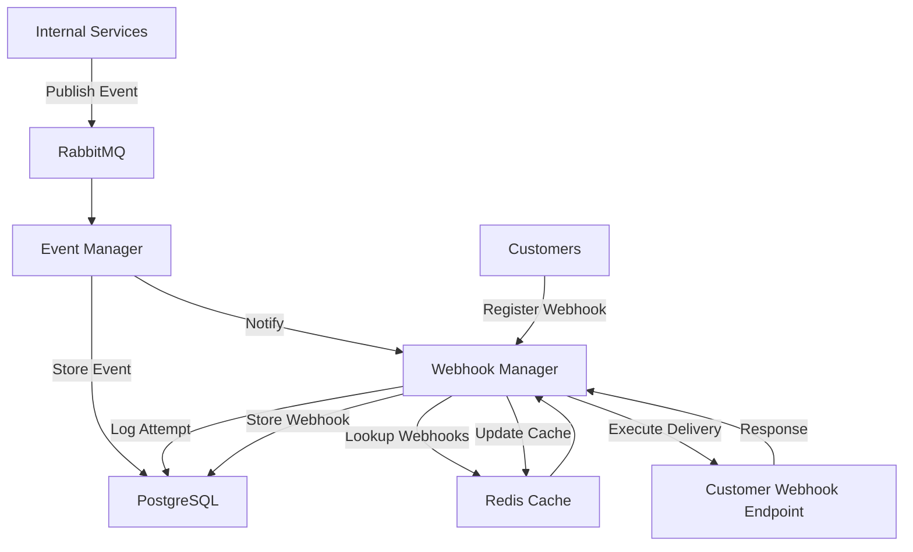

```mermaid
graph TD
    A[Internal Services] -->|Publish Event| B[RabbitMQ]
    B --> C[Event Manager]
    C -->|Store Event| D[PostgreSQL]
    C -->|Notify| E[Webhook Manager]
    E -->|Lookup Webhooks| F[Redis Cache]
    F --> E
    E -->|Execute Delivery| G[Customer Webhook Endpoint]
    G -->|Response| E
    E -->|Log Attempt| D
    H[Customers] -->|Register Webhook| E
    E -->|Store Webhook| D
    E -->|Update Cache| F
```